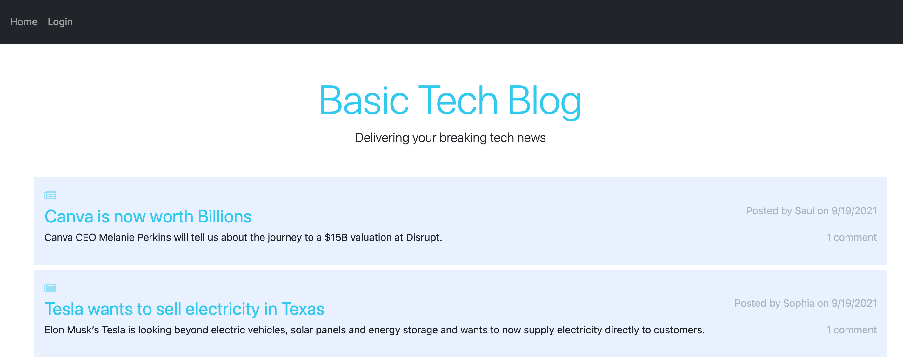
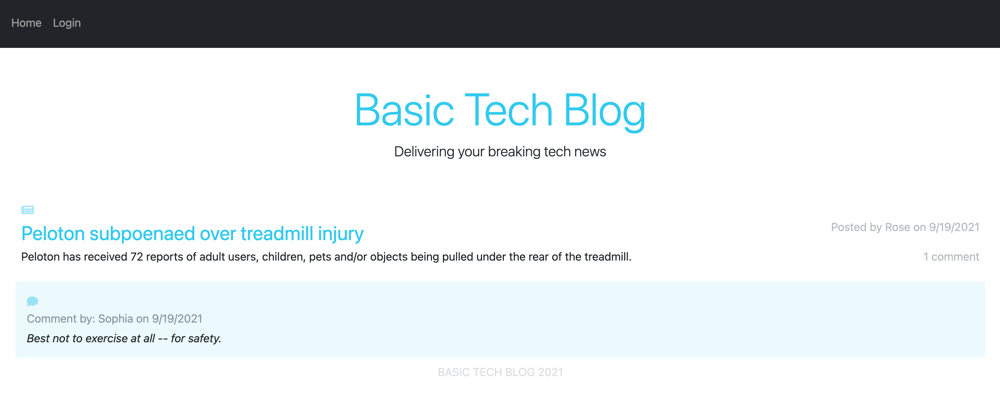

# 14 Model-View-Controller (MVC): Tech Blog

 

## Description
A blog where developers can publish their blog posts and comment on other developers’ posts as well. Built following the MVC paradigm, using handlebars.js, sequelize, express routes.

## Live site
https://stark-waters-66561.herokuapp.com/

## Screenshots

## Table of Contents
* [Installation](#installation)
* [Usage](#usage)
* [License](#license)
## Installation

*Steps required to install this project and get the application running:*

mysql source db/schema.sql, npm i, npm run seed, npm start
 ## Usage
*Instructions for use:*
publish articles

## License
Open

### Questions?

For any questions, please contact me with the information below:

GitHub: [@AF-cmdZ](https://api.github.com/users/AF-cmdZ)
